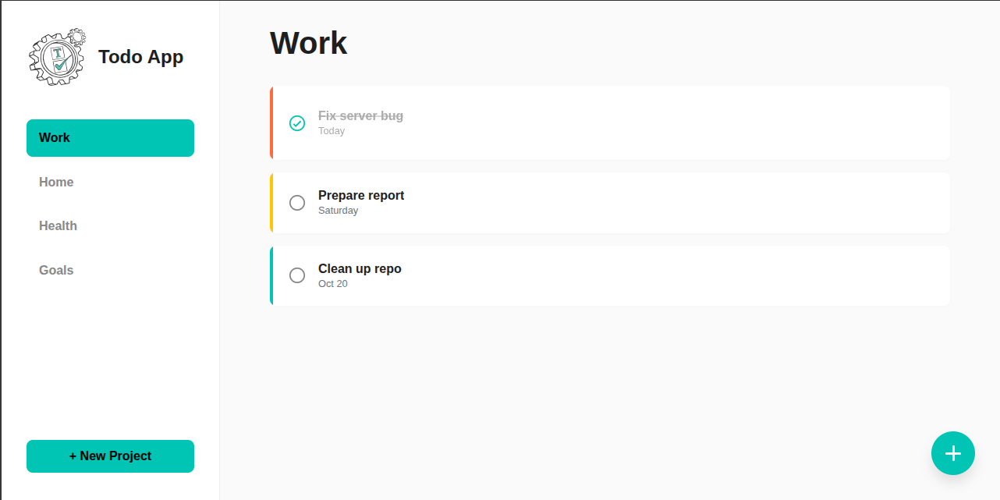

# Yet Another Todo App

A simple and intuitive vanilla JavaScript Todo App to organize your tasks and projects. Built with a focus on clean UI, good user experience, and zero framework dependencies.



## Features

- **Project Management**: Create, rename, and delete project folders to organize your tasks.
- **Full Task Management**: Add, edit, delete, and mark tasks as complete.
- **Task Priorities**: Assign High, Medium, or Low priority to each task, visualized with a color indicator.
- **Due Dates**: Set deadlines for your tasks for better time management.
- **Local Persistence**: All your projects and tasks are automatically saved to the browser's `localStorage`, so your data persists between sessions.
- **Responsive Design**: A mobile-first approach ensures a seamless experience on both desktop and mobile devices.
- **Smooth Animations**: Subtle animations for interactions like completing a task provide a polished user experience.

## Tech Stack

- **Client**: Vanilla JavaScript (ES6+), HTML5, CSS3
- **Build Tool**: Webpack
- **Libraries**:
  - [date-fns](https://date-fns.org/) for intelligent date formatting.
  - [Lucide](https://lucide.dev/) for clean and beautiful icons.
  - [anime.js](https://animejs.com/) for lightweight animations.

## Getting Started

To get a local copy up and running, follow these simple steps.

### Prerequisites

You need to have [Node.js](https://nodejs.org/) and npm installed on your machine.

To install or update npm to the latest version, run:

```sh
npm install npm@latest -g
```

### Installation

1.  Clone the repo
    ```sh
    git clone https://github.com/LIGECT/yet-another-todo-app.git
    ```
2.  Navigate to the project directory
    ```
    cd yet-another-todo-app
    ```
3.  Install NPM packages
    ```
    npm install
    ```

## Usage

- To run the app in development mode:

  ```sh
  npm start
  ```

  This will open the project in your default browser with hot-reloading enabled.

- To build the app for production:
  ```
  npm run build
  ```
  This will create a `dist` folder with the optimized and minified production-ready files.

## License

Distributed under the ISC License.
